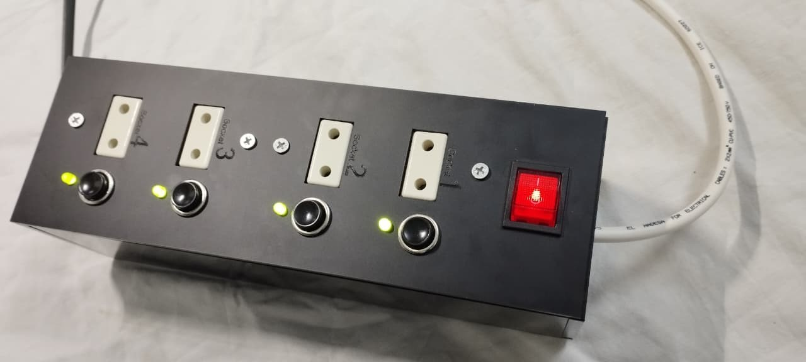
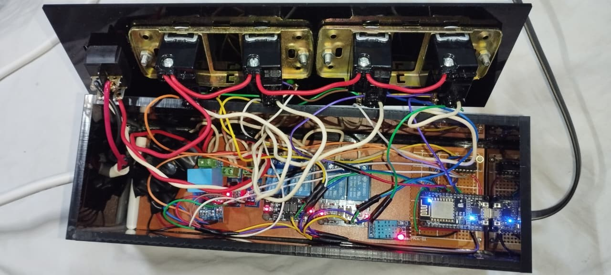
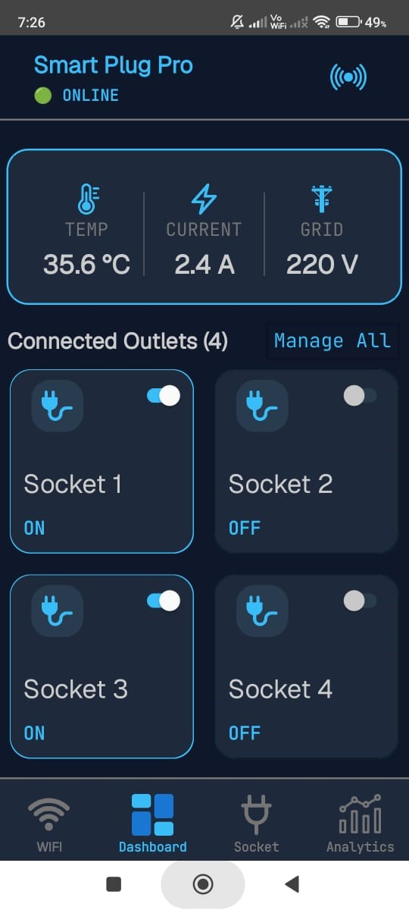
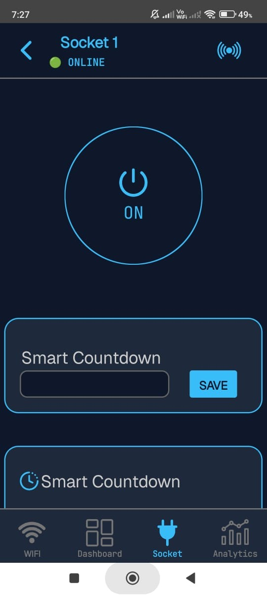
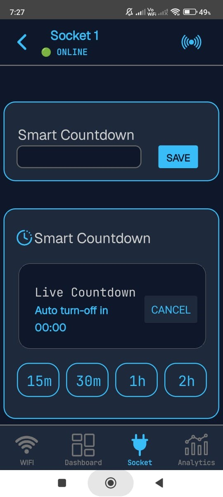
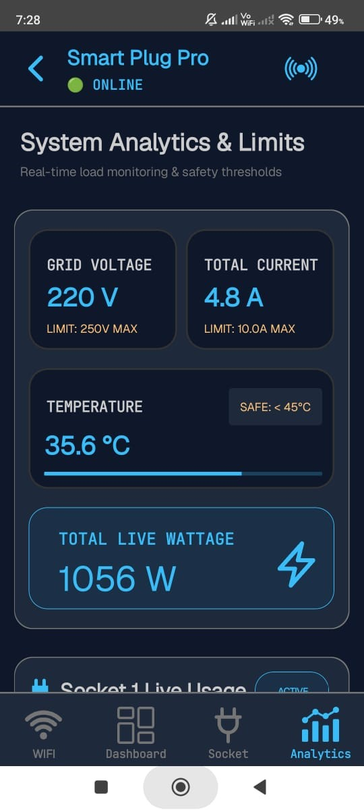
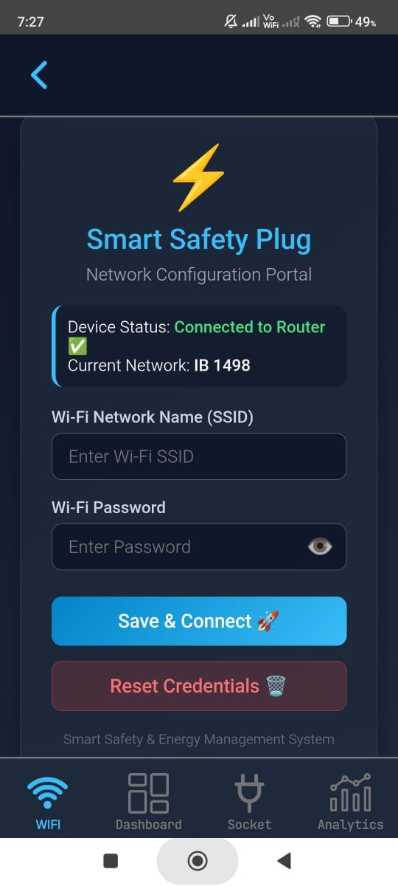

# ⚡ Smart Safety Plug: IoT-Based Multi-Sensor Power Strip

> **Real-Time Energy Telemetry, Dynamic Auto-Calibration, and Autonomous Failsafe Protection Engine**

An advanced, ESP8266-powered industrial-grade smart power strip engineered for high-accuracy AC power telemetry, active environmental thermal sensing, and sub-100ms multi-tier failsafe safety control. The system integrates real-time mathematical signal processing, dynamic zero-baseline drift cancellation, and piecewise linear scaling to overcome non-linear current sensor noise on single-channel 3.3V ADCs.

---

## 📌 Key Features

* **Comprehensive Power & Energy Telemetry:** Continuous measurement of total strip load, dedicated current on Outlet 1, True RMS line voltage, aggregate active wattage (W), internal casing temperature, and humidity.
* **True RMS Voltage & Line Monitoring:** Hardware-level brownout (<180V) and overvoltage (>240V) trip cutoffs engineered to protect downstream electronics from utility grid instability.
* **Active Thermal Protection Engine:** Real-time internal thermal tracking via a DHT11 sensor that autonomously trips all relays, halts active timers, and fires an audible swept alarm if temperatures exceed $45.0^\circ\text{C}$.
* **Dynamic Auto-Zero Calibration:** Cancels zero-load phantom current drift ($0.24\text{ A}$ offset) through startup baseline mapping and per-cycle DC compensation.
* **Piecewise Linear Scaling:** Segmented mathematical calibration optimized for non-linear Switch-Mode Power Supplies (SMPS) as well as heavy resistive/inductive loads.
* **Mux Cross-Talk Suppression:** Hardware switching settling delays ($300\,\mu\text{s}$) paired with dummy ADC sample cycles to purge sample-and-hold capacitor charge between multiplexed channels.
* **Smart Charger Auto-Cutoff:** Detects complete battery saturation on Outlet 1, automatically terminating power when current stays below $0.01\text{ A}$ for 5 continuous minutes.
* **Independent Countdown Timers:** Dedicated countdown engines for each individual socket with live remaining-time telemetry published over MQTT.
* **Zero-Code Captive Portal:** Offline Access Point configuration mode with an onboard HTTP/DNS server and non-volatile EEPROM storage for seamless Wi-Fi credential provisioning.
* **Deterministic MQTT Sync:** Low-overhead cloud messaging architecture supporting sub-second telemetry and instant emergency trip alerts.

---

## 🛠️ Hardware Architecture & Pin Mapping

| Component | Hardware Specification | Function / Pin Mapping |
| :--- | :--- | :--- |
| **Microcontroller** | NodeMCU (ESP8266) | Core processing, state machines, and Wi-Fi stack |
| **Analog Multiplexer** | CD74HC4051 (8-Channel) | Expands the single ESP8266 ADC (`A0`) across multiple analog sensor channels |
| **Current Sensors** | 2x ACS712 Hall-Effect (30A) | Measures aggregate strip current and dedicated Outlet 1 current draw |
| **Voltage Sensor** | ZMPT101B Module | Precision transformer-isolated AC mains voltage measurement |
| **Thermal Sensor** | DHT11 Module | Ambient temperature and humidity tracking for hardware thermal protection (`D5`) |
| **Relay Modules** | 4-Channel Optoisolated Relays | High-voltage AC line switching rated up to 10A/250V (`D0`, `D1`, `D2`, `D4`) |
| **Acoustic Indicator** | Active Piezo Buzzer | Auditory click feedback and swept frequency emergency trip alerts (`D3`) |
| **Power Supply** | Step-Down AC-DC Module | Provides regulated 5V DC power directly from the 220V AC input line |

---

## 🛡️ Autonomous Failsafe Rules Engine

The embedded firmware executes a deterministic safety routine locally on the ESP8266 to guarantee sub-100ms emergency isolation regardless of network connectivity:

* **Thermal Hazard Failsafe ($\ge 45.0^\circ\text{C}$):** Trips all 4 relays immediately, clears countdown timers, sounds the piezo alarm, and broadcasts an `OVERHEAT_WARNING` alert via MQTT. Resets only after internal cooling drops below $40.0^\circ\text{C}$.
* **Grid Voltage Protection (Egyptian Standard: 220V $\pm10\%$):**
  * **Brownout Cutoff ($<180\text{V}$):** Isolates all loads to prevent inductive motor overheating and current strain[cite: 1].
  * **Overvoltage Cutoff ($>240\text{V}$):** Protects downstream power supplies against transient spikes[cite: 1].
* **Multi-Tier Overcurrent Protection:**
  * **Outlet 1 Limit ($>8.5\text{A}$):** Prevents contact welding on Relay 1[cite: 1].
  * **Total Strip Limit ($>12.0\text{A}$):** Enforces continuous ratings for internal $2\text{ mm}^2$ wiring harnesses to eliminate fire risks[cite: 1].
* **Battery Float Auto-Cutoff:** Monitors Outlet 1; automatically terminates power if draw drops below $0.01\text{ A}$ for 5 continuous minutes ($300,000\text{ ms}$)[cite: 1].

---

## ⚙️ Mathematical Signal Processing & Algorithms

### 1. True RMS Current with Dynamic Auto-Zero Shift
To eliminate zero-drift errors and reference voltage fluctuations on the ADC[cite: 1]:

$$\text{autoZero} = \frac{1}{N} \sum_{i=1}^{N} V_{\text{raw}}[i]$$

$$I_{\text{RMS}} = \sqrt{\frac{1}{N} \sum_{i=1}^{N} \left(V_{\text{raw}}[i] - \text{autoZero}\right)^2}$$

### 2. Multiplexer Settling & ADC Discharge
To prevent charge retention inside the ESP8266 ADC sampling capacitor across multiplexer switches[cite: 1]:

```cpp
selectMuxChannel(channel);
delayMicroseconds(300);      // Channel settling time
analogRead(MUX_ANALOG_PIN);  // Dummy read to discharge ADC capacitor
```

## 📡 MQTT Telemetry & Topic Interface

### Ingress (Control & Commands)
* `smartplug/sub1` .. `4`: Remote toggle payloads (`1` / `0`) to independently switch Relays 1 through 4[cite: 1].
* `smartplug/timer1` .. `4`: Sets dedicated countdown timer durations in seconds for each outlet[cite: 1].
* `smartplug/check_status`: Forces an instantaneous full telemetry and state synchronization across all topics[cite: 1].

### Egress (Telemetry Broadcasts)
* `smartplug/state1` .. `4`: Real-time operational state feedback (`1` / `0`) for each relay channel[cite: 1].
* `smartplug/voltage`: Calculated AC mains True RMS line voltage in Volts ($\text{V}$)[cite: 1].
* `smartplug/current_total`: Total aggregate load current draw in Amperes ($\text{A}$)[cite: 1].
* `smartplug/current_outlet1`: Dedicated branch current consumption for Outlet 1 ($\text{A}$)[cite: 1].
* `smartplug/power_total`: Active total power consumption in Watts ($\text{W}$)[cite: 1].
* `smartplug/temp`: Real-time internal ambient temperature telemetry in Celsius ($^\circ\text{C}$)[cite: 1].
* `smartplug/rem1` .. `4`: Live remaining countdown time on active outlet timers (in seconds)[cite: 1].
* `smartplug/alerts`: Broadcasts real-time safety trip notifications (`OVERHEAT_WARNING`, `OVERVOLTAGE`, `OVERLOAD`)[cite: 1].

---

## 📷 Hardware Prototype Showcase

| Enclosed Functional Unit | Internal Wiring & Power Electronics |
| :---: | :---: |
|  |  |
| *Fully enclosed prototype with manual switches & status LEDs*[cite: 1] | *Internal optoisolated relays, sensors, NodeMCU & AC-DC conversion*[cite: 1] |

---

## 📱 Mobile Application Interfaces

### 1. Main Dashboard & Global Energy Monitoring
Real-time telemetry showing live AC mains voltage, total current draw, internal operating temperature, and global master controls for all connected outlets[cite: 1].

<p align="center">
  
</p>

---

### 2. Per-Outlet Control & Smart Countdown Timers
Independent power toggling per socket alongside configurable countdown schedules that display live remaining-time feedback directly on the interface[cite: 1].

| Socket Toggle & State | Live Countdown & Timer Setup |
| :---: | :---: |
|  |  |
| *Individual socket control & telemetry*[cite: 1] | *Real-time countdown timer configuration*[cite: 1] |

---

### 3. Energy Analytics & Wi-Fi Provisioning

| Real-Time Consumption & Limit Thresholds | On-Device Captive Portal Configuration |
| :---: | :---: |
|  |  |
| *Total live wattage, grid limits & Outlet 1 usage*[cite: 1] | *Zero-code onboarding web interface via onboard AP*[cite: 1] |

---

## 🎥 Live System Demonstration

* **Field Test & Functional Video:** [Watch Live Demonstration Link](https://bit.ly/44XcFuD)[cite: 1]

---

## 📄 License & Attribution

Distributed under the MIT License. Designed and engineered by **SmartPlug Team** (Ain Shams University)[cite: 1].
